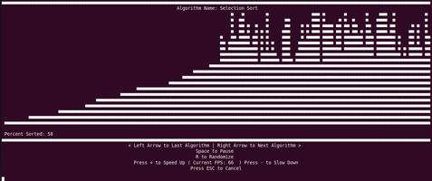

# Terminal Sorting Visualizer

A Display of Sorting Algorithm Graphs written in C# and based in the Terminal

This project is quite old and doesn't have the best practices within it, such as a separate thread running to
observe terminal inputs. I may change this later in time, but as of now this serves as a legacy practice project.

The project can be used by running "dotnet run" from the project's root directory with the dotnet runtime downloaded.
The download for the .NET runtime can be found on [learn.microsoft.com](https://learn.microsoft.com/en-us/dotnet/core/install/)

The project simulates the sorting of a random set of data through each algorithm, and it allows for the speeding and slowing down of each algorithm with the + and - keys, as well as switching in between algorithms with the Left Arrow and Right Arrow keys.

It should be noted that as of right now, the project does not simulate the speed of each algorithm, but instead each individual step that is taken. So simple algorithms with little actual swaps like Selection and Insertion Sort will seem to take less time than more complex algorithms like Merge and Quick sort.

